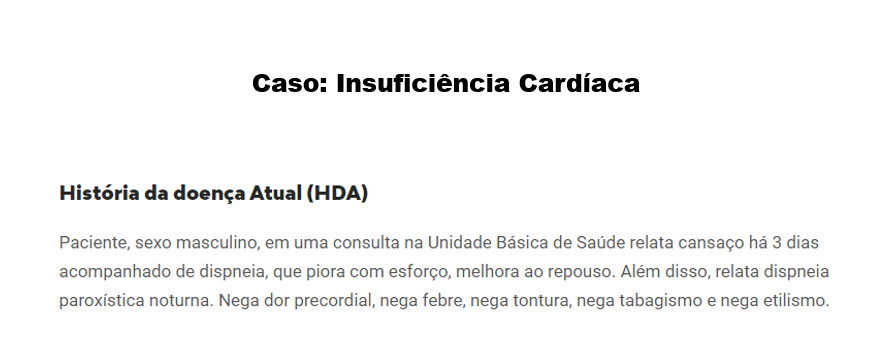
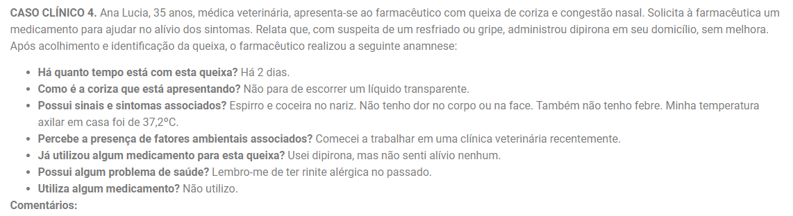
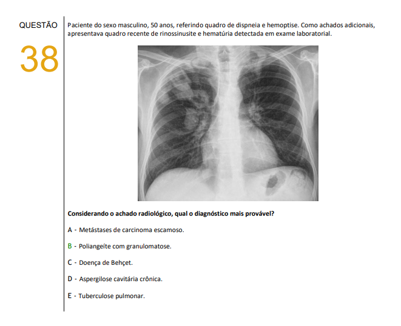

# Cura - A Inteligência Artificial que Revoluciona o Diagnóstico e o Atendimento Hospitalar 🤖

## Resumo

O projeto visa encontrar uma maneira de otimizar os processos hospitalares, desde a criação da ficha de pacientes até diagnósticos de doenças e prescrições de remédios. 

Para o desenvolvimento do projeto foi utilizado algumas ferramentas como o Google Colab, a linguagem Python e o elemento principal: a Inteligência Artificial Generativa do Google. O entendimento e a criação desse projeto só foi possível graças a Imersão IA 2ª Edição da Alura em parceria com o Google. 

## Introdução 

O sistema de saúde, tanto em âmbito hospitalar quanto no Sistema Único de Saúde (SUS), enfrenta diversos desafios que impactam diretamente a qualidade do atendimento e o bem-estar dos pacientes. Entre os principais problemas, podemos destacar longas filas de espera, falta de integração entre sistemas, esgotamento dos profissionais, ineficiência na gestão de recursos e a necessidade de um atendimento mais humanizado.

Diante desses desafios, a inteligência artificial (IA) surge como uma poderosa ferramenta para otimizar processos e transformar a realidade do sistema de saúde. Através da análise de grandes volumes de dados, a IA pode auxiliar na resolução dos problemas mencionados e contribuir para a construção de um sistema de saúde mais eficiente, acessível e humanizado.

## Como a IA pode auxiliar os hospitais?

+ **Redução de filas de espera**: Um estudo do Beth Israel Deaconess Medical Center, em Massachusetts, nos EUA, indicou que o uso de IA para otimizar a gestão de leitos pode reduzir em até 40% o tempo de espera dos pacientes por um leito no pronto-socorro. Algoritmos inteligentes podem otimizar o agendamento de consultas e procedimentos, diminuindo o tempo de espera dos pacientes e melhorando o fluxo de atendimento.
  
+ **Integração de sistemas**: A IA pode integrar diferentes sistemas de informação, permitindo o acesso a um prontuário eletrônico unificado e completo do paciente. Ela pode otimizar o agendamento de consultas e cirurgias, levando em conta a disponibilidade de médicos, leitos e equipamentos, além de priorizar casos urgentes. Além disso, a IA pode prever a demanda por leitos, evitando superlotação e otimizando sua alocação. No diagnóstico, a IA pode integrar dados de diferentes exames e históricos de pacientes para auxiliar os médicos na tomada de decisões.
  
+ **Auxílio no diagnóstico**: Sistemas de IA podem analisar imagens médicas, como radiografias e tomografias, com alta precisão, auxiliando no diagnóstico precoce e preciso de doenças. Um estudo do Hospital Mount Sinai, em Nova York, demonstrou que a IA pode reduzir o tempo de diagnóstico de pneumonia em até 50%, quando comparado ao diagnóstico tradicional por radiologistas.
  
+ **Personalização do tratamento**: A IA pode analisar dados do paciente para a criação de planos de tratamento personalizados e mais eficazes, considerando suas características individuais e histórico médico. Algoritmos inteligentes podem analisar dados médicos complexos, incluindo histórico familiar, estilo de vida e informações genéticas, para identificar padrões e prever riscos individuais. Com base nessa análise, a IA pode auxiliar os médicos na escolha do tratamento mais adequado, ajustando doses de medicamentos, identificando potenciais efeitos colaterais e personalizando o acompanhamento do paciente.

+ **Suporte à decisão clínica**: Ferramentas de IA podem fornecer aos profissionais de saúde informações relevantes e atualizadas para auxiliar na tomada de decisões clínicas, otimizando o diagnóstico e o tratamento. 

+ **Gestão de recursos**: A IA pode auxiliar na otimização da gestão de recursos, como leitos, medicamentos e insumos, reduzindo desperdícios e garantindo o acesso a serviços de saúde de qualidade. (Descrever como a IA pode ser utilizada para auxiliar na gestão de recursos, com exemplos práticos e resultados de pesquisas)
Atendimento humanizado: Chatbots e assistentes virtuais podem oferecer suporte aos pacientes, agendando consultas, respondendo perguntas e fornecendo informações, liberando tempo para que os profissionais de saúde se dediquem ao atendimento mais humanizado e personalizado. (Descrever como a IA pode ser utilizada para melhorar o atendimento humanizado, com exemplos práticos)

## Solução

Pensando nos problemas apresentados e no impacto da IA nos hospitais, desenvolvemos a **Cura**.

### O que é a **Cura**?

+  Diagnósticos ágeis e precisos: A **Cura** analisa seus sintomas e queixas com maestria, fornecendo as principais suspeitas diagnósticas com rapidez e precisão, otimizando o processo de encaminhamento para o médico especialista e diminuindo o tempo de espera por atendimento.

+  Exames mais direcionados: A **Cura** sugere os exames mais precisos e eficientes para cada caso, otimizando o tempo e os recursos do hospital, além de reduzir o desconforto do paciente com exames desnecessários.

+  Atendimento sob medida: A **Cura** classifica a gravidade do quadro do paciente com base em diversos fatores, garantindo que os casos mais urgentes recebam atenção imediata, enquanto pacientes com problemas menos graves são direcionados para o fluxo adequado.

+  Histórias clínicas completas em um piscar de olhos: A **Cura** escuta ativamente a consulta médica e cria fichas de pacientes de forma instantânea e precisa, liberando tempo valioso para que a equipe médica se concentre no que realmente importa: o cuidado com o paciente.

+  Acessível: A **Cura** é totalmente gratuita e de fácil utilização, projetada para atender às necessidades de todos os hospitais, desde os grandes centros médicos particulares até as unidades básicas de saúde do SUS.

A **Cura** não é apenas uma ferramenta, é a chave para um futuro onde o diagnóstico e o atendimento hospitalar são mais precisos, eficientes e humanizados. Porque saúde de qualidade deve ser um direito universal, acessível a todos, independentemente de renda, status social ou tipo de instituição de saúde

## Resultados 

### Interface

Ao rodar o código o sistema solicitará o nome do usuário: 

Após digitar o usuário digitar o nome, a IA perguntará como pode ajudar o usuário e as opções que ele tem para prosseguir. O usuário pode digitar o seu comando ou se precisar de algum arquivo para analisar basta digitar a palavra "arquivo" no chat.

Caso o usuário digite "arquivo", a IA solicitará o caminho (path) do arquivo que o usuário fez upload no Google Colab. 

Se o usuário não souber fazer o upload ou não sabe o caminho do arquivo, basta escrever "ajuda" no chat. Dessa maneira, a IA apresenta instruções de como fazer o upload e copiar o caminho do arquivo, tornando o programa mais acessível a pessoas que nunca usaram o Colab.

---------------------------------------------------------------------------------------------------------------------------------------------------------------------------------------------------------------------

Na pasta testes, estão todos os arquivos e prompts que usei para testar a funcionalidade da IA.

### Comando com apenas texto 

1 - Diagnóstico

Para testar a capacidade de diagnóstico da IA, busquei algumas questões comumente encontradas nas provas de residência médica onde um quadro clínico é apresentado e deve-se dar o diagnóstico possível. Quadros clínicos foram retirados do link: https://sanarmed.com/casos-clinicos-de-medicina-recentes-para-se-atualizar/

Como exemplo, escolhi o seguinte caso clínico disponível no site: 

Após iniciar a IA inserindo meu nome, digitei o seguinte comando: 

Dado o caso clínico: Paciente, sexo masculino, em uma consulta na Unidade Básica de Saúde relata cansaço há 3 dias acompanhado de dispneia, que piora com esforço, melhora ao repouso. Além disso, relata dispneia paroxística noturna. Nega dor precordial, nega febre, nega tontura, nega tabagismo e nega etilismo. Qual o diagnóstico mais provável?

---------------------------------------------------------------------------------------------------------------------------------------------------------------------------------------------------------------------
#### Resposta da IA: 

Resposta:  Com base nos sintomas relatados, o diagnóstico mais provável é **Insuficiência Cardíaca**. 

A dispneia,  piora com esforço e  melhora com repouso, juntamente com a dispneia paroxística noturna, são sintomas clássicos da IC.  

Para confirmar o diagnóstico e determinar a causa base, seriam necessários exames complementares como:

-   **Eletrocardiograma:**  para avaliar o ritmo e a função elétrica do coração.
-   **Radiografia de tórax:**  para verificar o tamanho e a forma do coração, além de detectar congestão pulmonar.
-   **Ecocardiograma:**  para avaliar a estrutura e a função do coração, incluindo a fração de ejeção.
-   **Exames laboratoriais:**  como hemograma completo, função renal, eletrólitos e marcadores de função cardíaca (BNP e NT-proBNP).

Possíveis causas da Insuficiência Cardíaca:

-   Doença arterial coronariana
-   Hipertensão arterial
-   Doenças valvares cardíacas
-   Miocardiopatias

Tratamento da Insuficiência Cardíaca:

O tratamento da IC depende da causa subjacente e da gravidade dos sintomas. As opções terapêuticas incluem:

-  **Medicamentos:**  como diuréticos, inibidores da ECA, betabloqueadores, antagonistas da aldosterona e digitálicos.
-   **Mudanças no estilo de vida:**  como dieta com baixo teor de sódio, restrição hídrica, controle do peso e atividade física regular.
-   **Procedimentos:**  como angioplastia coronariana, cirurgia de revascularização do miocárdio ou implante de dispositivos cardíacos.

**Lembrando que sou uma inteligência artificial para otimizar os resultados. Os diagnósticos, pedidos de exames e prescrições devem ser feitos SEMPRE por médicos com CRM ativo.**

---------------------------------------------------------------------------------------------------------------------------------------------------------------------------------------------------------------------

2 - Medicação recomendada

Para testar a capacidade de recomendação de medicamento da IA, foi utilizado um caso clínico que se espera a recomendação de anti-histamínico e descongestinantes nasais.

Comando: Qual o medicamento mais provável para prescrição dado o seguinte caso:  Ana Lucia, 35 anos, médica veterinária, apresenta-se ao farmacêutico com queixa de coriza e congestão nasal. Solicita à farmacêutica um medicamento para ajudar no alívio dos sintomas. Relata que, com suspeita de um resfriado ou gripe, administrou dipirona em seu domicílio, sem melhora. Após acolhimento e identificação da queixa, o farmacêutico realizou a seguinte anamnese:  Há quanto tempo está com esta queixa? Há 2 dias. Como é a coriza que está apresentando? Não para de escorrer um líquido transparente. Possui sinais e sintomas associados? Espirro e coceira no nariz. Não tenho dor no corpo ou na face. Também não tenho febre. Minha temperatura axilar em casa foi de 37,2ºC. Percebe a presença de fatores ambientais associados? Comecei a trabalhar em uma clínica veterinária recentemente. Já utilizou algum medicamento para esta queixa? Usei dipirona, mas não senti alívio nenhum. Possui algum problema de saúde? Lembro-me de ter rinite alérgica no passado. Utiliza algum medicamento? Não utilizo

---------------------------------------------------------------------------------------------------------------------------------------------------------------------------------------------------------------------

#### Resposta da IA: 

Resposta:  Com base nos sintomas de Ana Lucia, um medicamento comumente indicado seria um **descongestionante nasal tópico**, como **oximetazolina** ou **nafazolina**. Esses medicamentos ajudam a reduzir a congestão nasal, aliviando a coriza e a sensação de nariz entupido. 

É importante considerar a possibilidade de rinite alérgica, devido ao histórico da paciente e ao trabalho em clínica veterinária, que a expõe a potenciais alérgenos. Um **anti-histamínico oral**, como **loratadina** ou **cetirizina**, pode ser associado ao descongestionante nasal para um melhor controle dos sintomas.

**Recomendações:**

*   O uso de descongestionantes nasais tópicos deve ser limitado a poucos dias, pois o uso prolongado pode levar ao efeito rebote.
*   A dipirona não é eficaz no tratamento de sintomas de resfriado ou rinite alérgica.
*   É importante investigar a possibilidade de alergia a animais, considerando o trabalho da paciente em uma clínica veterinária.

***Lembrando que sou uma inteligência artificial para otimizar os resultados. Os diagnósticos, pedidos de exames e prescrições devem ser feitos SEMPRE por médicos com CRM ativo.***
 
---------------------------------------------------------------------------------------------------------------------------------------------------------------------------------------------------------------------

3 - Comandos que não estão relacionados a área da saúde

O intuito do pojeto é criar uma IA que atue exclusivamente para auxiliar os profissionais da saúde, então não cabe a ela responder perguntas ou realizar comandos que não estejam relacionados com a área da saúde. Com isso, graças a possibilidade de configuração do 'system_instruction' da GenAI do Google, é possível criar essa regra. A seguir, segue um exemplo de como a IA responde caso perguntada sobre algo que não envolve sua área de atuação.

Comando: Quanto foi o jogo do São Paulo ontem?

---------------------------------------------------------------------------------------------------------------------------------------------------------------------------------------------------------------------

#### Resposta da IA: 

Resposta:  Eu sou uma assistente de saúde, não cabe a mim responder isso. 

---------------------------------------------------------------------------------------------------------------------------------------------------------------------------------------------------------------------

### Comando com arquivos

1 - Arquivo de áudio

Para testar a capacidade da IA receber arquivos e trabalhar com eles foi utilizado como base um exemplo de anamnese (Consulta médica para adquirir os dados e queixas do paciente) de um vídeo no Youtube do canal do CDDE da Faculdade de Medicina de RIbeirão Preto da USP disponível no link: https://www.youtube.com/watch?v=-BsAJyoj_Kw 

A IA tem a capacidade de analisar o vídeo e descrever com precisão as situações que ocorrem nele. Porém, a fim de exigir mais da IA, extrai apenas o áudio do vídeo (Disponível na pasta Testes) e com esse áudio pedi para IA que ela criasse a ficha do paciente, apenas com as informações que ele forneceu durante a consulta.

Comando: Analise esse áudio e crie uma ficha de paciente com os dados e as queixas que ele relata.

---------------------------------------------------------------------------------------------------------------------------------------------------------------------------------------------------------------------

#### Resposta da IA: 
Resposta: Ficha de Paciente

**Nome:** Carlos
**Idade:** 52 anos
**Estado Civil:** Casado
**Profissão:** Escritor de Engenharia
**Naturalidade:** Ribeirão Preto
**Residência:** Ribeirão Preto

**Queixa Principal:** Dor no peito
**Histórico da Dor:**

* **Episódio 1:** Dor fraca no meio do peito enquanto trabalhava no escritório. Não deu importância.
* **Episódio 2:** Dor mais forte no meio do peito enquanto caminhava. A dor irradiou para o braço esquerdo e sentiu-se "meio abafado". A dor diminuiu ao reduzir o ritmo da caminhada.
* **Episódio 3:** Dor fraca no meio do peito enquanto estava em casa à noite. Ficou mais preocupado.

**Outras Informações:**

* A dor passa sozinha após alguns minutos.
* Não utilizou medicamentos para aliviar a dor.
* Boa digestão e intestino funcionando bem.
* Sem histórico familiar de problemas cardíacos.
* Ex-fumante (dos 14 aos 38 anos, média de meio maço por dia).
* Consumo de cerveja somente aos finais de semana.
* Não pratica atividade física regularmente, apenas caminhadas 3 a 4 vezes por semana.
* Não se considera estressado ou ansioso.

**Observações:**

* Paciente relata dor torácica com características sugestivas de angina. 
* É importante investigar a causa da dor e avaliar a saúde cardiovascular do paciente.

**Lembrando que sou uma inteligência artificial para otimizar os resultados. Os diagnósticos, pedidos de exames e prescrições devem ser feitos SEMPRE por médicos com CRM ativo.** 

---------------------------------------------------------------------------------------------------------------------------------------------------------------------------------------------------------------------

2 - Arquivo imagem

Outro arquivo utilizado, foi a imagem de uma radiografia retirada da Prova de Residência da CRB (Colégio Brasileiro de Radiologia) de 2021, a questão base está representada a seguir:

Ao inserir a imagem, o comando utilizado foi: Sabendo que a imagem apresenta uma radiologia de um paciente do sexo masculino, 50 anos, referindo quadro de dispneia e hemoptise. Como achados adicionais, apresentava quadro recente de rinossinusite e hematúria detectada em exame laboratoria. Qual o diagnóstico mais provável?

---------------------------------------------------------------------------------------------------------------------------------------------------------------------------------------------------------------------

#### Resposta da IA: 

Resposta:  A radiografia de tórax apresentada demonstra um aumento da densidade em campos pulmonares superiores, bilateral, sugerindo processo inflamatório/infeccioso, possivelmente pneumonia. 

Considerando o quadro clínico de dispneia, hemoptise, rinossinusite recente e hematúria, a principal hipótese diagnóstica é **Granulomatose com poliangeíte (GPA)**, anteriormente conhecida como Granulomatose de Wegener.

A GPA é uma doença autoimune rara que causa inflamação dos vasos sanguíneos, afetando principalmente os pulmões, seios nasais e rins. As manifestações pulmonares podem variar de pneumonia a hemorragia alveolar.

**Exames complementares para confirmar o diagnóstico:**

* Tomografia computadorizada de tórax de alta resolução (TCAR)
* Biópsia pulmonar para análise histopatológica
* Testes sorológicos para detecção de anticorpos anticitoplasma de neutrófilos (ANCA), especialmente c-ANCA (anti-proteinase 3)

**ATENÇÃO:** Lembrando que sou uma inteligência artificial para otimizar os resultados. Os diagnósticos, pedidos de exames e prescrições devem ser feitos **SEMPRE** por médicos com CRM ativo. 

---------------------------------------------------------------------------------------------------------------------------------------------------------------------------------------------------------------------

## Conclusão

A implementação da IA em hospitais representa um marco na busca por um atendimento médico mais eficaz, preciso e humanizado. Através da otimização de processos, do auxílio na tomada de decisões e da promoção de uma experiência mais personalizada para o paciente, a IA se configura como uma ferramenta essencial para o futuro da saúde.

É importante ressaltar que a IA não substitui o profissional médico, mas atua como um poderoso aliado, complementando suas habilidades e ampliando suas capacidades. A relação entre homem e máquina deve ser pautada pela colaboração, aprimorando o atendimento e proporcionando melhores resultados para os pacientes.

O futuro da saúde é promissor, com a IA Generativa do Google mostra como pode ser aliada na construção de um sistema mais eficiente, humanizado e acessível a todos.

