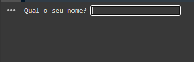
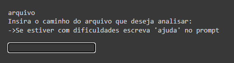
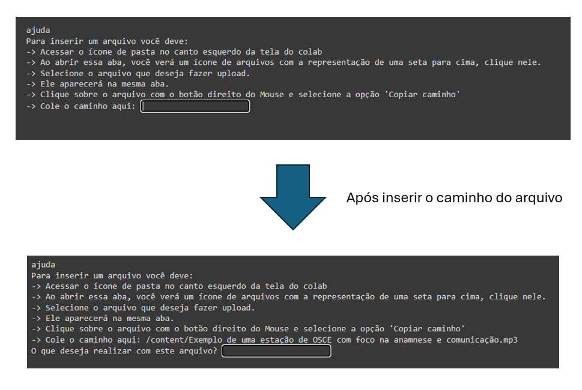

# Cura - A Inteligência Artificial que Revoluciona o Diagnóstico e o Atendimento Hospitalar 🤖

## Resumo

O projeto visa encontrar uma maneira de otimizar os processos hospitalares, desde a criação da ficha de pacientes até diagnósticos de doenças e prescrições de remédios. 

Para o desenvolvimento do projeto foi utilizado algumas ferramentas como o Google Colab, a linguagem Python e o elemento principal: a Inteligência Artificial Generativa do Google. O entendimento e a criação desse projeto só foi possível graças a Imersão IA 2ª Edição da Alura em parceria com o Google. 

## Introdução 

O sistema de saúde, tanto em âmbito hospitalar quanto no Sistema Único de Saúde (SUS), enfrenta diversos desafios que impactam diretamente a qualidade do atendimento e o bem-estar dos pacientes. Entre os principais problemas, podemos destacar longas filas de espera, falta de integração entre sistemas, esgotamento dos profissionais, ineficiência na gestão de recursos e a necessidade de um atendimento mais humanizado.

Diante desses desafios, a inteligência artificial (IA) surge como uma poderosa ferramenta para otimizar processos e transformar a realidade do sistema de saúde. Através da análise de grandes volumes de dados, a IA pode auxiliar na resolução dos problemas mencionados e contribuir para a construção de um sistema de saúde mais eficiente, acessível e humanizado.

## Como a IA pode auxiliar os hospitais?

+ **Redução de filas de espera**: Um estudo do Beth Israel Deaconess Medical Center, em Massachusetts, nos EUA, indicou que o uso de IA para otimizar a gestão de leitos pode reduzir em até 40% o tempo de espera dos pacientes por um leito no pronto-socorro. Algoritmos inteligentes podem otimizar o agendamento de consultas e procedimentos, diminuindo o tempo de espera dos pacientes e melhorando o fluxo de atendimento.
  
+ **Integração de sistemas**: A IA pode integrar diferentes sistemas de informação, permitindo o acesso a um prontuário eletrônico unificado e completo do paciente. Ela pode otimizar o agendamento de consultas e cirurgias, levando em conta a disponibilidade de médicos, leitos e equipamentos, além de priorizar casos urgentes. Além disso, a IA pode prever a demanda por leitos, evitando superlotação e otimizando sua alocação. No diagnóstico, a IA pode integrar dados de diferentes exames e históricos de pacientes para auxiliar os médicos na tomada de decisões.
  
+ **Auxílio no diagnóstico**: Sistemas de IA podem analisar imagens médicas, como radiografias e tomografias, com alta precisão, auxiliando no diagnóstico precoce e preciso de doenças. Um estudo do Hospital Mount Sinai, em Nova York, demonstrou que a IA pode reduzir o tempo de diagnóstico de pneumonia em até 50%, quando comparado ao diagnóstico tradicional por radiologistas.
  
+ **Personalização do tratamento**: A IA pode analisar dados do paciente para a criação de planos de tratamento personalizados e mais eficazes, considerando suas características individuais e histórico médico. Algoritmos inteligentes podem analisar dados médicos complexos, incluindo histórico familiar, estilo de vida e informações genéticas, para identificar padrões e prever riscos individuais. Com base nessa análise, a IA pode auxiliar os médicos na escolha do tratamento mais adequado, ajustando doses de medicamentos, identificando potenciais efeitos colaterais e personalizando o acompanhamento do paciente.

+ **Suporte à decisão clínica**: Ferramentas de IA podem fornecer aos profissionais de saúde informações relevantes e atualizadas para auxiliar na tomada de decisões clínicas, otimizando o diagnóstico e o tratamento. 

+ **Gestão de recursos**: A IA pode auxiliar na otimização da gestão de recursos, como leitos, medicamentos e insumos, reduzindo desperdícios e garantindo o acesso a serviços de saúde de qualidade. (Descrever como a IA pode ser utilizada para auxiliar na gestão de recursos, com exemplos práticos e resultados de pesquisas)
Atendimento humanizado: Chatbots e assistentes virtuais podem oferecer suporte aos pacientes, agendando consultas, respondendo perguntas e fornecendo informações, liberando tempo para que os profissionais de saúde se dediquem ao atendimento mais humanizado e personalizado. (Descrever como a IA pode ser utilizada para melhorar o atendimento humanizado, com exemplos práticos)

## Solução

Pensando nos problemas apresentados e no impacto da IA nos hospitais, desenvolvemos a **Cura**.

### O que é a **Cura**?

+  Diagnósticos ágeis e precisos: A **Cura** analisa seus sintomas e queixas com maestria, fornecendo as principais suspeitas diagnósticas com rapidez e precisão, otimizando o processo de encaminhamento para o médico especialista e diminuindo o tempo de espera por atendimento.

+  Exames mais direcionados: A **Cura** sugere os exames mais precisos e eficientes para cada caso, otimizando o tempo e os recursos do hospital, além de reduzir o desconforto do paciente com exames desnecessários.

+  Atendimento sob medida: A **Cura** classifica a gravidade do quadro do paciente com base em diversos fatores, garantindo que os casos mais urgentes recebam atenção imediata, enquanto pacientes com problemas menos graves são direcionados para o fluxo adequado.

+  Histórias clínicas completas em um piscar de olhos: A **Cura** escuta ativamente a consulta médica e cria fichas de pacientes de forma instantânea e precisa, liberando tempo valioso para que a equipe médica se concentre no que realmente importa: o cuidado com o paciente.

+  Acessível: A **Cura** é totalmente gratuita e de fácil utilização, projetada para atender às necessidades de todos os hospitais, desde os grandes centros médicos particulares até as unidades básicas de saúde do SUS.

A **Cura** não é apenas uma ferramenta, é a chave para um futuro onde o diagnóstico e o atendimento hospitalar são mais precisos, eficientes e humanizados. Porque saúde de qualidade deve ser um direito universal, acessível a todos, independentemente de renda, status social ou tipo de instituição de saúde

## Resultados 

### Interface

Ao rodar o código o sistema solicitará o nome do usuário: 

Após digitar o usuário digitar o nome, a IA perguntará como pode ajudar o usuário e as opções que ele tem para prosseguir. O usuário pode digitar o seu comando ou se precisar de algum arquivo para analisar basta digitar a palavra "arquivo" no chat.

Caso o usuário digite "arquivo", a IA solicitará o caminho (path) do arquivo que o usuário fez upload no Google Colab. 

Se o usuário não souber fazer o upload ou não sabe o caminho do arquivo, basta escrever "ajuda" no chat. Dessa maneira, a IA apresenta instruções de como fazer o upload e copiar o caminho do arquivo, tornando o programa mais acessível a pessoas que nunca usaram o Colab.

### IA em ação

Na pasta testes, estão todos os arquivos e prompts que usei para testar a funcionalidade da IA.

#### Comando com apenas texto 

- Texto de caso clínico + link do site
- resposta esperada
- Resposta dada pela IA
  

